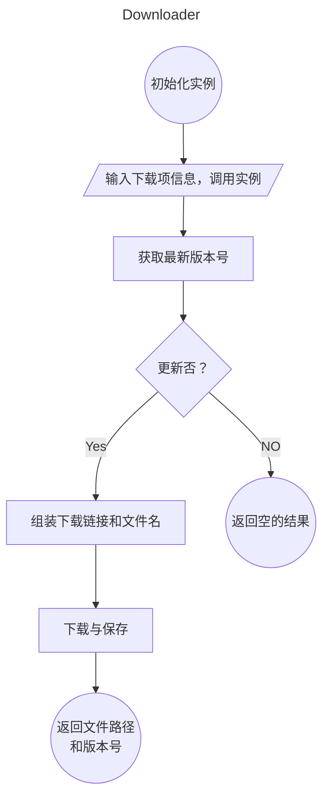
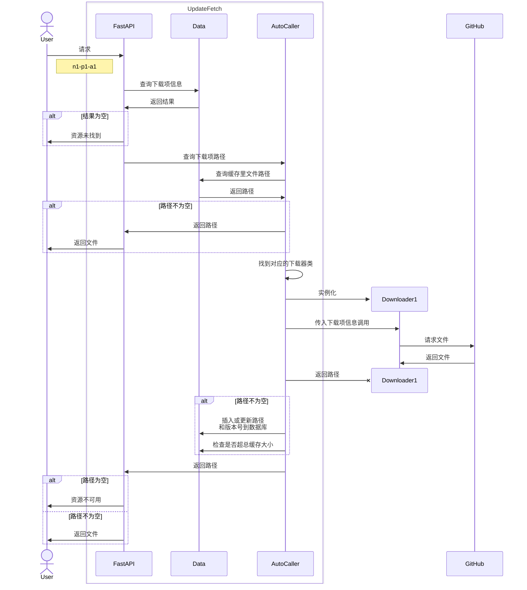

# UpdateFetch

UpdateFetch 代理下载文件，方便在特殊网络环境中分享、下载软件。能够下载的项目依赖于用户的配置，目前提供 GitHub、F-Droid 平台的下载器。

在网页显示支持下载的软件，方便使用： [UpdateFetch](http://updatefetch.vfly2.eu.org/)


## 使用

在网页上复制某个软件的下载链接，通过此链接总是下载该软件指定平台和架构的最新版本。

下载链接的格式为：`http://updatefetch.vfly2.eu.org/download/?name=xray&platform=linux&arch=amd64`，通过三元组（名称、平台、架构）确定要下载的文件。


## 管理员

安装步骤在博客： [代理下载文件 UpdateFetch 的安装步骤 - 技焉洲](https://yanh.tech/2024/02/deployment-process-of-updatefetch/)


### 下载项配置文件


#### GitHub release

> 本项目最初参考的是：在 Linux 上，下载 GitHub 平台软件最新版的 shell 脚本，因此 GitHub 下载器的思路是一样的：组装下载地址

以 xray 为例

```yaml
xray:   # 软件名，作为三元组中的名称
  category_title: Server   # 在网页上的分类，可省略
  image: https://ib.ahfei.blog/imagesbed/xray_logo_cpd-24-01-03.webp   # 在网页上的图片，可省略
  website: github   # 用哪个下载器
  project_name: XTLS/Xray-core   # 项目名称
  sample_url: ~/${tag}/Xray-${system}-${ARCHITECTURE}${suffix_name}   # release 中的下载链接，${} 包裹的在下载时会被替换成实际值
  system:   # 软件要下载哪些系统的，左边是用于重命名的标准名称，右边的列表里，左项是 sample_url 中应该实际填写的，右边是对应的后缀名
    windows: [windows, .zip]
    linux: [linux, .zip]
  architecture:   # 软件要下载哪些架构的，左边是用于重命名的标准名称，右边是 sample_url 中应该实际填写的
    arm64: arm64-v8a
    amd64: '64'
```

最终，下载器会组合出 4 个下载链接，并下载，假设查到的最新版是 v1.8.7， 4 个网址分别是

```
https://github.com/XTLS/Xray-core/releases/download/v1.8.7/Xray-windows-arm64-v8a.zip
https://github.com/XTLS/Xray-core/releases/download/v1.8.7/Xray-windows-64.zip
https://github.com/XTLS/Xray-core/releases/download/v1.8.7/Xray-linux-arm64-v8a.zip
https://github.com/XTLS/Xray-core/releases/download/v1.8.7/Xray-linux-64.zip
```

对于 GitHub，sample_url 前面一部分是一样的，因此用 `~` 代替。

---

tag 切片。如果 GitHub 某项目的 tag 是这种 desktop-v2023.12.1，但实际文件名要的是 2023.12.1，可以使用切片取 tag 的一部分。

第一个字符的索引取 0，不支持 `[9:]` 这种写法，而是 `[9:18]` 不能有空的，两边都要有数字，不检查是否合法。由于左闭右开，要填 18，而不是 17。最终是 `${tag[9:18]}`


#### FDroid

```yaml
schildchat:
  website: fdroid
  project_name: de.spiritcroc.riotx   # 这个到软件在 FDroid 网站的页面，其网址最后一部分就是
  architecture:
    arm64: arm64-v8a
  # 因为 FDroid 上都是 Android 平台的 APP，因此不必填写系统
```

FDroid 目前遇到了 3 种形式：
1. 第一种是四种架构的下载地址不一样（架构名是固定的 x86_64, x86, arm64-v8a, armabi-v7a），例子： https://f-droid.org/en/packages/de.spiritcroc.riotx/
2. 第二种是四种架构合一的，每个版本只有 1 个下载链接，在所有架构都通用，例子： https://f-droid.org/en/packages/com.osfans.trime/
3. 不显示架构的，每个版本只有 1 个下载链接，例子： https://f-droid.org/en/packages/org.fox.tttrss/ ，暂时不支持


#### 单一个下载链接

> Emby 在 GitHub 的下载，是在项目仓库中放着，下载链接是固定的，并且没法判断版本

和 GitHub release 一样，只是 project_name 是主页网址，sample_url 就是最终的网址，这样相当于其下指定的平台架构有同一个网址。

```yaml
emby_for_android:
  category: Mobile
  image: https://ib.ahfei.blog/imagesbed/favicon-emby.png
  website: only1link
  project_name: https://github.com/MediaBrowser/Emby.Releases
  sample_url: https://github.com/MediaBrowser/Emby.Releases/raw/master/android/emby-android-google-arm64-v8a-release.apk
  system:
    android: [android, .apk]
  architecture:
    arm64: arm64
```


## 设计

下载后的文件暂时会重命名，格式为： **软件名-系统-架构-版本.后缀名**，每个部分用 `-` 连接。

### 功能

下载：
- [x] 请求 `/download/?name=n1&platform=p1&arch=a1` 时，根据三元组返回最新版本的文件，如果未在下载项配置文件里有对应的配置，就返回错误码
- [ ] 请求 `/download/?name=n1&platform=p1&arch=a1&version=v1` 时，根据四元组返回指定版本的文件，未配置就返回错误码
- [ ] 以某种规则限制单位时间里的下载次数，避免滥用

缓存：
- [x] 总缓存空间大小限制，要超出时，按一定规则删除一些；当缓存中只有一个文件时，这个文件的大小可以超出缓存
- [ ] 每个下载项可以定义一个缓存失效时间，在有效期内，不检查新版本，始终返回缓存中的文件；超出有效期则检查新版本，若有则更新

网页：
- [ ] 首页显示配置里每一项的元信息和对应规范后的下载链接，每个分类单独一个按钮，点击就刷新为对应内容
- [ ] 惰式加载
- [ ] 按名称搜索

### 程序结构

目录结构：
1. 根目录有入口文件 main.py，配置面和数据面的类，和代理下载的类
2. examples 里是配置文件，在安装过程中这里面的文件会复制一份到 config_and_data_files ，数据库文件也在此保存
3. static 和 templates 放着网页需要的文件
4. downloader 放着下载器的类，抽象基类在 AbstractClass.py，为不同网站实现的下载器类在各自文件中

安装过程中会创建 config_and_data_files 目录:
1. config.yaml 和 pgm_config.yaml，程序配置文件
2. items.yaml，下载项配置文件
3. uf.db，数据库文件

### 下载器流程图



下载项信息是一个命名元组，包含了所有需要的信息，包括缓存中的版本号以对比是否需要更新。

在“下载与保存”中，先根据状态码判断下载链接是否有效，有效再进行，无效返回空的路径；


### 请求下载时序图

请求 `/download/?name=n1&platform=p1&arch=a1`



